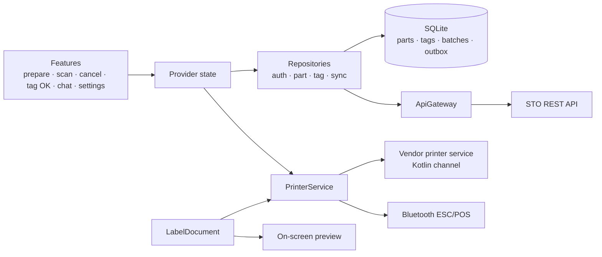

<div align="center">

# 🏷️ STO Prep

**Stock-taking (STO) tag system for manufacturing plants, built for rugged Android handhelds with a built-in thermal printer.**


</div>

---

## Overview

Stock-taking (*Stock Taking Opname*) at a manufacturing plant means printing a physical tag for every pallet or rack, counting it twice by independent teams, and making sure no tag is lost, duplicated or silently cancelled. Doing that with spreadsheets and hand-written tags produces missing counts and no audit trail.

**STO Prep** runs the whole flow on the shop floor handheld (Blueprint MPOS 332 / Senraise H10):

```
Prepare : log in with employee ID → search part/job → choose tag count → preview → auto-print QR tags
Count   : scan QR tag → part details appear → enter quantity → queued to server {nik, tag_no, team, qty}
Cancel  : scan tag (own or printed elsewhere) → submit request → admin approves or rejects
```

Built for **PT Mekar Armada Jaya** (Tambun plant). About 25k lines of Dart across 95 files, covered by **250 unit and golden tests**.

## Key Features

- **Unique, gap-free tag numbers**: sequence numbers are reserved per batch from the server, with a local fallback prefix (`L…`) flagged for reconciliation when offline
- **Print exactly what you preview**: one `LabelDocument` model renders both the on-screen preview and the ESC/POS commands, so they can never drift apart
- **Direct printer integration**: talks to the handheld's internal printer through the vendor service (Kotlin platform channel) to detect paper-out, with Bluetooth SPP as a fallback
- **Double counting by team**: team A and team B count the same tag independently; within a team only the original recorder can correct a number
- **Audited cancellation**: every cancellation, even by an admin, becomes a request that another admin approves or rejects
- **Device pairing**: operators can only log in on handhelds paired to their employee ID via `ANDROID_ID` (MAC addresses are randomised on modern Android)
- **Role-based menus**: admins grant each operator *prepare / count / cancel* rights and the plant areas they may work in (IFRM, PRESS, IFPP, WELD, IFPD)
- **Offline-first**: SQLite cache for the part master, tags and an outbox queue that syncs once the network is back
- **Admin console in the app**: manage STO events (only one open at a time), users and permissions, paired devices, server address and local data
- **In-app chat and announcements** between operators and admins during the event

## Architecture



| Layer | Responsibility |
|---|---|
| `features/` | Screens: splash, auth, home, search, prepare, preview, scan, cancel, tag OK, history, chat, device, settings |
| `state/` | `provider` notifiers for session, printer, prepare, count, cancel, chat, admin, settings |
| `data/repositories` | Business rules: cache-first part search, tag status as the source of truth, outbox sync |
| `data/local` | `sqflite` tables plus `SharedPreferences` for session and settings |
| `data/remote` | `ApiClient`, `StoApi` contract, `HttpStoApi`, `ApiGateway` |
| `services/` | Printer abstraction, sequence reservation, device identity, sound and haptic feedback |

## Business Rules Enforced

| Rule | How the app enforces it |
|---|---|
| Print count equals the number of **unique** tags | Sequence reserved per batch; every sheet gets its own `tag_no` |
| A tag can be printed only once | `tag_no` is UNIQUE, and `markPrinted` only updates rows still in `draft` |
| Tags exist only inside an official STO period | An open STO event covering today is required; its `event_id` is stored on every tag |
| Cancelled tags are never counted | The scan page rejects cancelled or pending-cancel tags before the quantity field opens |
| Operators only prepare their own areas | Part search is filtered by the areas granted by an admin |
| Only company devices are used | Operator login requires an employee ID ↔ `ANDROID_ID` pairing |

The full list, including failure scenarios such as paper-out, Bluetooth drops and damaged tags, is in the Indonesian docs below.

## Tech Stack

| Area | Packages |
|---|---|
| Framework | Flutter (Dart 3.10), `provider` |
| Storage | `sqflite`, `shared_preferences`, `path_provider` |
| Hardware | `blue_thermal_printer`, `mobile_scanner`, custom Kotlin channel for the vendor printer and `ANDROID_ID` |
| Output | `qr_flutter`, bitmap rendering for crisp box grids on 58 mm thermal paper |
| UX | `audioplayers` sound cues and haptic feedback, `intl` for Indonesian formatting |

## Getting Started

```bash
flutter pub get
flutter run                  # install on the handheld or an Android phone
flutter build apk --release  # release build
```

> **32-bit handhelds:** the target devices report `armeabi-v7a` only. Don't build with `--target-platform android-arm64`, or the APK installs but crashes on launch. The default `flutter build apk --release` already includes `armeabi-v7a`.

On an emulator or a phone without a built-in printer, the app falls back to a simulated printer that writes the output to the log, so every other flow still works.

## Testing

```bash
flutter test                   # unit + golden tests (label layout)
flutter test --update-goldens  # after intentionally changing the paper layout
```

## Documentation

| Document | Contents |
|---|---|
| [docs/README.id.md](docs/README.id.md) | Full technical and operational guide (Indonesian) |
| [docs/API_CONTRACT.md](docs/API_CONTRACT.md) | Request/response contract for existing and proposed endpoints |
| [docs/SKENARIO_CETAK.md](docs/SKENARIO_CETAK.md) | Printing failure scenarios and how the app handles them |
| [docs/AUDIT_GO_LIVE.md](docs/AUDIT_GO_LIVE.md) | Pre-go-live audit: findings, risks and decisions |
| [docs/RILIS_PLAYSTORE.md](docs/RILIS_PLAYSTORE.md) | Release checklist for Google Play |

## Author

**Efrino Wahyu Eko Pambudi**: [GitHub](https://github.com/efrino) · [LinkedIn](https://www.linkedin.com/in/efrinowep/) · [Portfolio](https://efrino.netlify.app)
